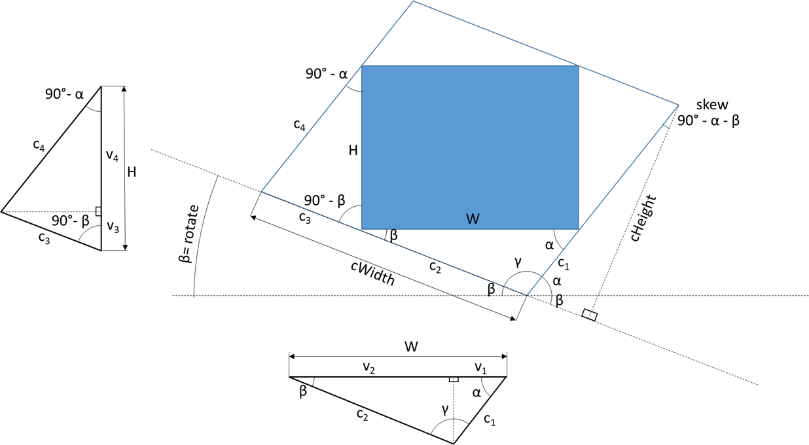

Пусть дан прямоугольник с шириной $W$ и высотой $H$. Вокруг него описан параллелограмм с внутренними углами $\gamma$ (противолежащий к ширине прямоугольника) и $\alpha + \beta$ (противолежащий к высоте прямоугольника). Углы $\beta$ , $\gamma$ , ширина $W$ и высота $H$ полностью обуславливают описанный вокруг прямоугольника параллелограмм.

Искомые величины для описания параллелограмма - ширина $cWidth$, высота $cheight$, угол искажения $skew$ и угол наклона $rotate$.

Пусть вершины прямоугольника делят стороны параллелограмма на отрезки $c_1$ ... $c_4$. Высота каждого прилежащего треугольника делит сторону прямоугольника в на отрезки $v_1$ ... $v_4$. Найдём длины этих отрезков, зная что сумма $v_1 + v_2 = W$, а $v_3 + v_4 = H$. Для этого выразим высоту каждого прилежащего к прямоугольнику треугольника через длины отрезков $v_1$ ... $v_4$ и пангенс прилежащего к отрезку угла треугольника:

$$
\begin{cases}
    h_1 = v_1 \cdot tg(\alpha) \\
    h_1 = v_2 \cdot tg(\beta)
\end{cases}
$$

аналогично для $v_3$ и $v_4$:

$$
\begin{cases}
    h_2 = v_3 \cdot tg( 90 \degree - \beta) = v_3 \cdot ctg(\beta)  \\
    h_2 = v_4 \cdot tg(90 \degree - \alpha) = v_4 \cdot ctg(\alpha)
\end{cases}
$$

таким образом:

$$
    v_1 \cdot tg(\alpha) =  v_2 \cdot tg(\beta) \\
    v_3 \cdot сtg(\beta) =  v_4 \cdot сtg(\alpha)
$$

Выразим $v_1$ ... $v_4$ как корни систем уравнений:

$$
\begin{cases}
W = v_1 + v_2 \\
\frac {tg(\beta)} {tg(\alpha)}=  \frac {v_1}  {v_2} \\
\end{cases}
$$

$$
\begin{cases}
H = v_3 + v_4 \\
\frac {tg(90\degree - \beta)} {tg(90\degree - \alpha)}= \frac  {ctg(\beta)} {ctg(\alpha)}= \frac  {tg(\alpha)} {tg(\beta)} =  \frac {v_4}  {v_3} \\
\end{cases}
$$

Обозначив соотношение тангенсов углов $\beta$ и $\alpha$ как

$$
k_1 =  \frac{tg(\beta)} {tg(\alpha)}; \quad	k_2 = \frac{1} {k_1}
$$

Получим выражения для $v_1$ ... $v_4$:

$$
v_1 = \frac {W \cdot k_1} {k_1+1}; \quad v_2 = \frac {W } {k_1+1}
$$

$$
v_3 = \frac {H} {k_2+1}; \quad v_4 = \frac {H \cdot k_2 } {k_2+1}
$$

Через соотношения для отрезков $v_1$ ... $v_4$, учитывая что они являются катетами прямоугольных треугольников с гипотенузами равными отрезкам $с_1$ ... $с_4$, получим выражения для $с_1$ ... $с_4$:

$$
c_1 =  \frac{v_1} {cos(\alpha)} = \frac{W \cdot k_1} {(k_1+1) \cdot cos(\alpha)}
$$

$$
c_2 =  \frac{v_2} {cos(\beta)}=  \frac{W} {(k_1+1) \cdot cos(\beta)}
$$

$$
c_3 = \frac {v_3} {cos(90 \degree - \beta)} = \frac {v_3} {sin(\beta)} = \frac{H} {((k_2+1) \cdot sin(\beta)}
$$

$$
c_4 = \frac {v_4} {cos(90 \degree - \alpha)} = \frac {v_4} {sin(\alpha)} =\frac{H \cdot k_2} {((k_2+1) \cdot sin(\alpha)}
$$

Таким образом, искомые величины для описания параллелограмма:

$$
skew =  90\degree - (\alpha + \beta)
$$

$$
rotate = \beta
$$

$$
cWidth = c_2 + c_4
$$

$$
cHeight = (c_1 + c_3) \cdot cos(90\degree - (\alpha + \beta)) = (c_1 + c_3) \cdot sin(\alpha + \beta)
$$
